<a name="readme-top"></a>

[![Contributors][contributors-shield]][contributors-url]
[![Forks][forks-shield]][forks-url]
[![Stargazers][stars-shield]][stars-url]
[![Issues][issues-shield]][issues-url]
[![MIT License][license-shield]][license-url]
[![LinkedIn][linkedin-shield]][linkedin-url]

<!-- PROJECT LOGO -->
<br />
<div align="center">
  <a href="https://github.com/Aboudoc/Constant-Product-AMM.git">
    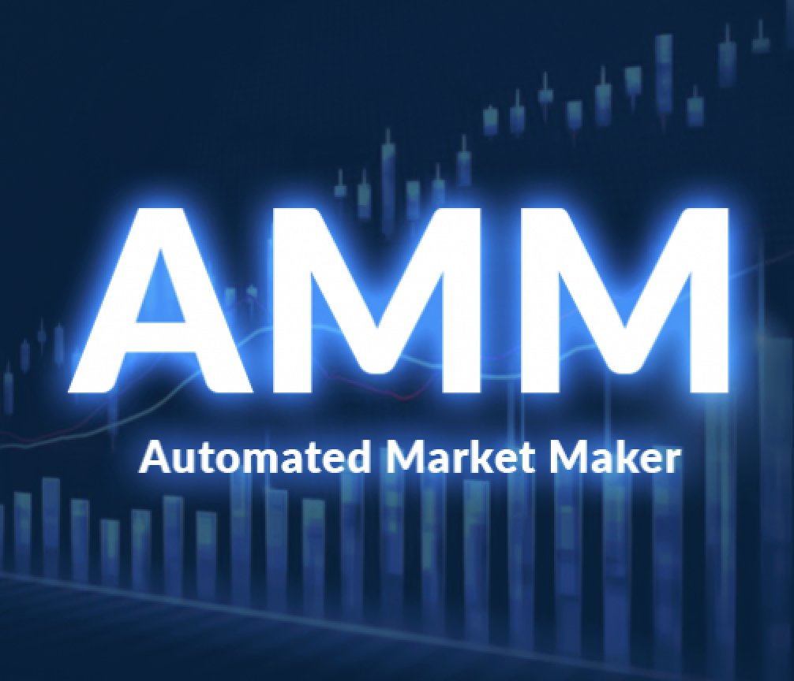
  </a>

<h3 align="center">Constant Product Automated Market Maker</h3>

  <p align="center">
    A basic Constant Product AMM 
    <br />
    <a href="https://github.com/Aboudoc/Constant-Product-AMM"><strong>Explore the docs »</strong></a>
    <br />
    <br />
    <a href="https://github.com/Aboudoc/Constant-Product-AMM">View Demo</a>
    ·
    <a href="https://github.com/Aboudoc/Constant-Product-AMM/issues">Report Bug</a>
    ·
    <a href="https://github.com/Aboudoc/Constant-Product-AMM/issues">Request Feature</a>
  </p>
</div>

<!-- TABLE OF CONTENTS -->
<details>
  <summary>Table of Contents</summary>
  <ol>
    <li>
      <a href="#about-the-project">About The Project</a>
      <ul>
        <li><a href="#built-with">Built With</a></li>
      </ul>
    </li>
    <li>
      <a href="#getting-started">Getting Started</a>
      <ul>
        <li><a href="#prerequisites">Prerequisites</a></li>
        <li><a href="#installation">Installation</a></li>
      </ul>
    </li>
    <li><a href="#usage">Usage</a></li>
    <li><a href="#Constant-Product-AMM">Constant Product AMM</a></li>
    <li><a href="#Time-Weighted-Average-Price">Time Weighted Average Price</a></li>
    <li><a href="#Uniswap-V2-Price-Oracle">Uniswap V2 Price Oracle</a></li>
    <li><a href="#Constant-Product-AMM-Spot-Price-Examples">Constant Product AMM Spot Price Examples</a></li>
    <li><a href="#Uniswap-V3-Price-Oracle">Uniswap V3 Price Oracle</a></li>
    <li><a href="#Geometric-Mean">Geometric Mean</a></li>
    <li><a href="#Uniswap-V3-TWAP-and-Geometric-Mean">Uniswap V3 TWAP and Geometric Mean</a></li>
    <li><a href="#Uniswap-V3-TWAP-Inverse-Price">Uniswap V3 TWAP Inverse Price</a></li>
    <li><a href="#roadmap">Roadmap</a></li>
    <li><a href="#contributing">Contributing</a></li>
    <li><a href="#license">License</a></li>
    <li><a href="#contact">Contact</a></li>
    <li><a href="#acknowledgments">Acknowledgments</a></li>
  </ol>
</details>

<!-- ABOUT THE PROJECT -->

## About The Project

This project shows a basic Constant Product Automated Market Maker.

You will also find all the Maths used in Uniswap V2 and Uniswap V3

<p align="right">(<a href="#readme-top">back to top</a>)</p>

### Built With

- [![Hardhat][Hardhat]][Hardhat-url]
- [![Ethers][Ethers.js]][Ethers-url]

<p align="right">(<a href="#readme-top">back to top</a>)</p>

<!-- GETTING STARTED -->

## Getting Started

To get a local copy up and running follow these simple example steps.

### Prerequisites

- npm

  ```sh
  npm install npm@latest -g
  ```

- hardhat

  ```sh
  npm install --save-dev hardhat
  ```

  ```sh
  npm install @nomiclabs/hardhat-ethers @nomiclabs/hardhat-waffle
  ```

  run:

  ```sh
  npx hardhat
  ```

  verify:

  ```sh
  npx hardhat verify --network goerli "contract address" "pair address"
  ```

### Installation

1. Clone the repo
   ```sh
   git clone https://github.com/Aboudoc/Constant-Product-AMM.git
   ```
2. Install NPM packages
   ```sh
   npm install
   ```
3. Dependencies

   ```sh
   npm i @uniswap/v2-core @uniswap/v2-periphery
   ```

<p align="right">(<a href="#readme-top">back to top</a>)</p>

<!-- USAGE EXAMPLES -->

## Usage

If you need testnet funds, use the [Alchemy testnet faucet](https://goerlifaucet.com/).

**This project shows a basic example of Constant Product AMM**

## Constant Product AMM

Constant product AMM (automated market maker) is a decentralized exchange where 2 tokens are traded.

<p align="right">(<a href="#readme-top">back to top</a>)</p>

## Why is it called constant product?

<div>
 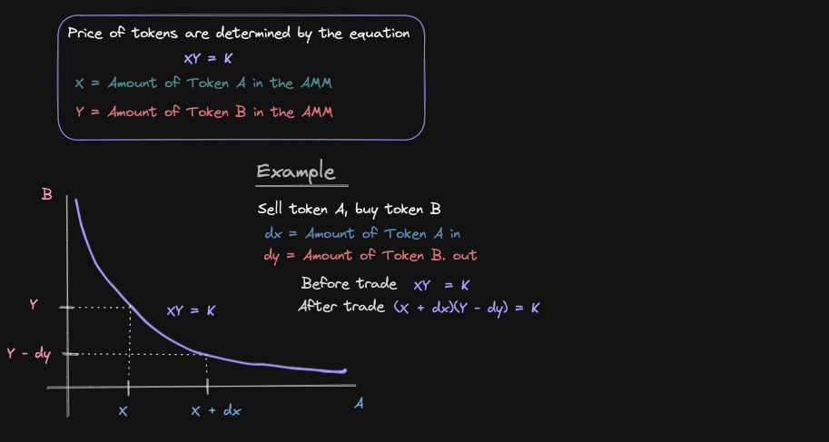
</div>

### Swap - How many dy for dx?

<div>
 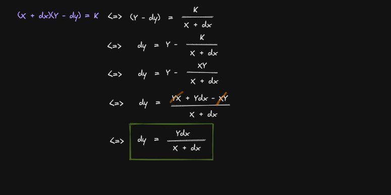
</div>

**Uniswap trading fee = 0.3%**

<div>
 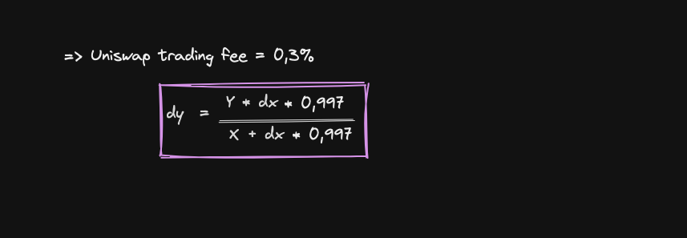
</div>

### Add liquidity - How many dx, dy to add?

<div>
 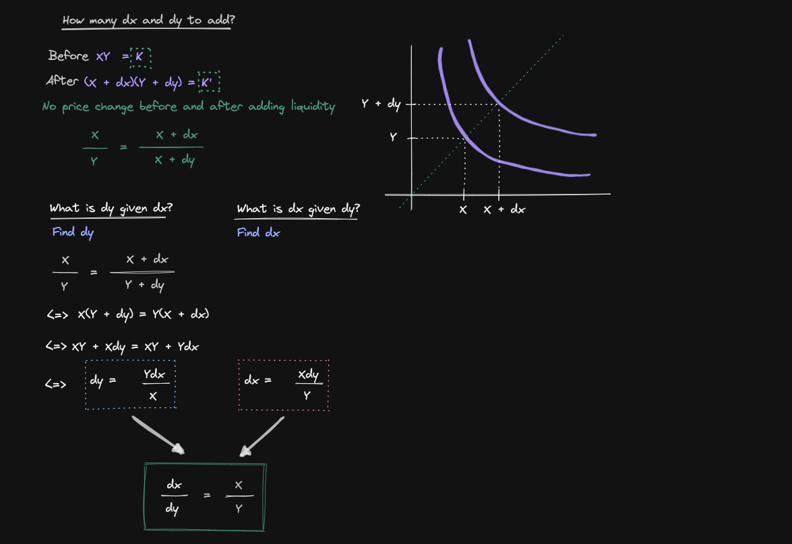
</div>

#### Add liquidity - How many shares to mint?

<div>
 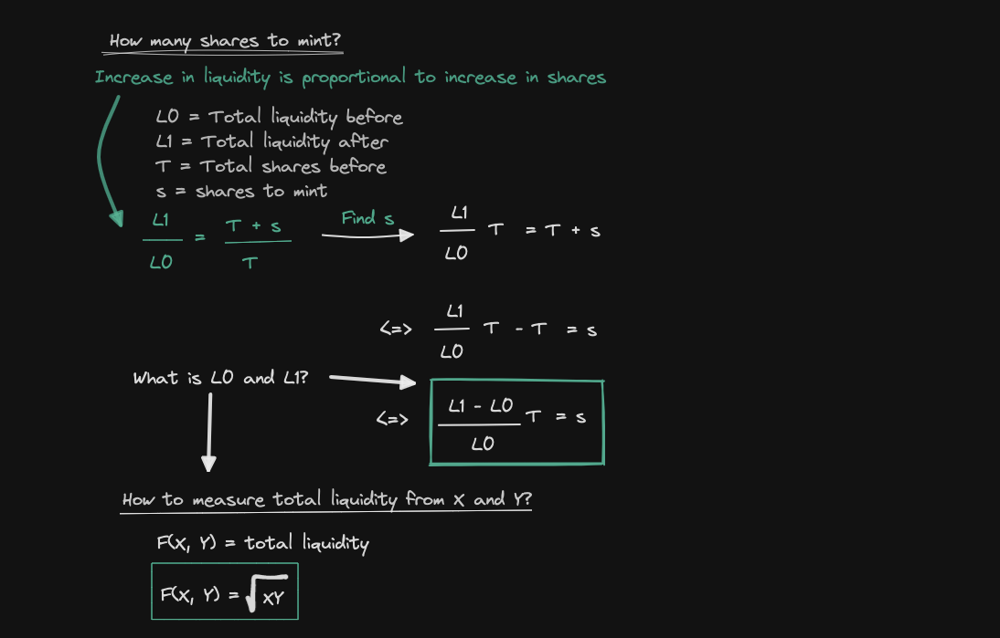
</div>

Motivation:

<div>
 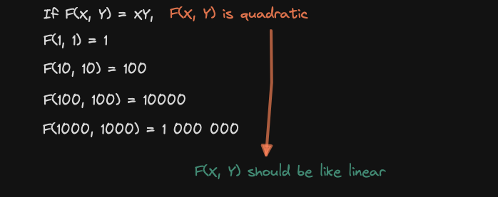
</div>

What is L0 and L1

<div>
 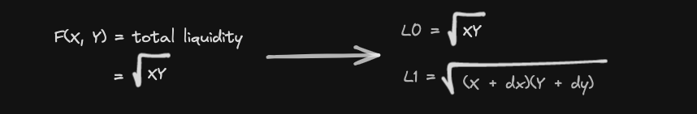
</div>

Simplify the equation:

<div>
 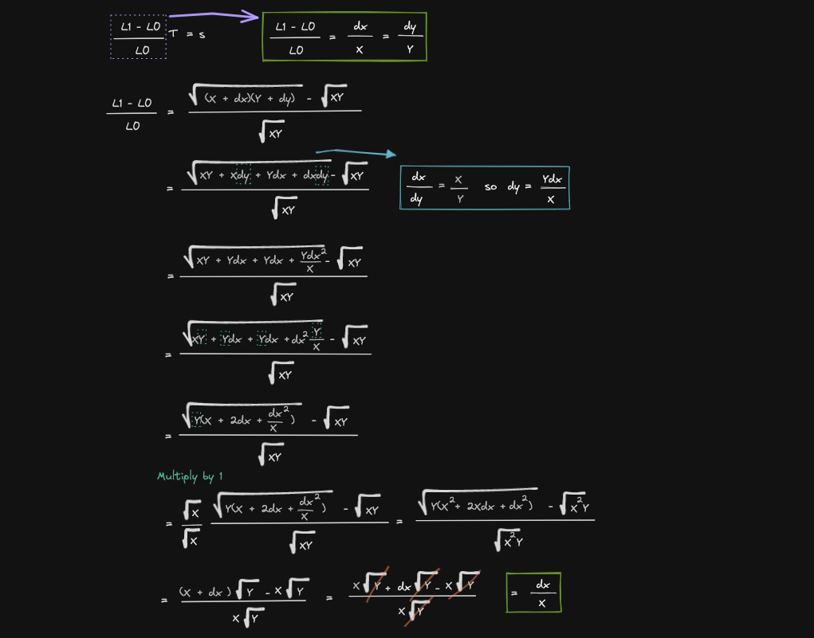
</div>

**Conclusion**

<div>
 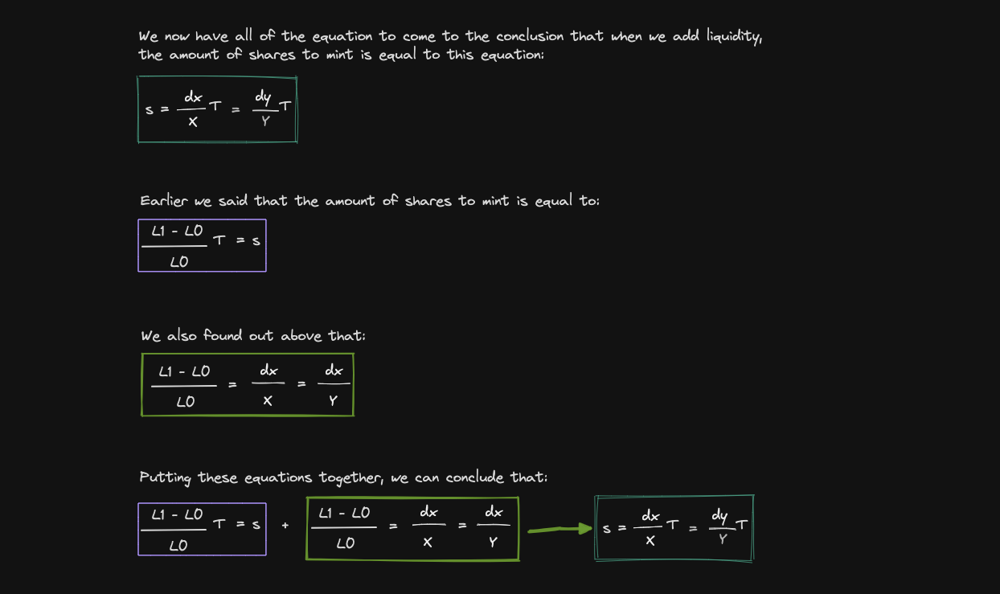
</div>

### Remove liquidity - How many tokens to withdraw?

<div>
 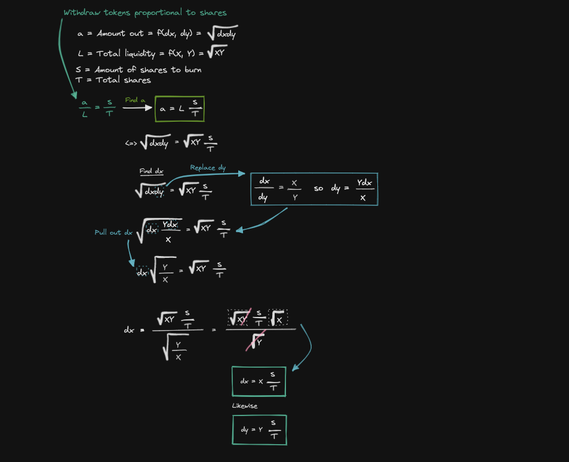
</div>

## Time Weighted Average Price

<div>
 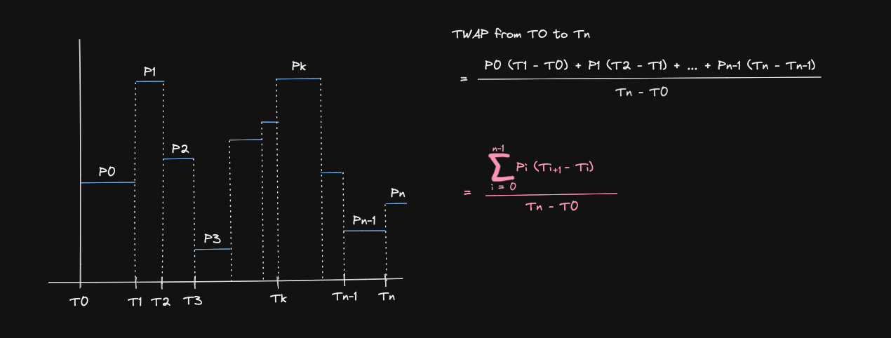
</div>

### How do we compute the Time Weighted Average Price from Tk to Tn?

<div>
 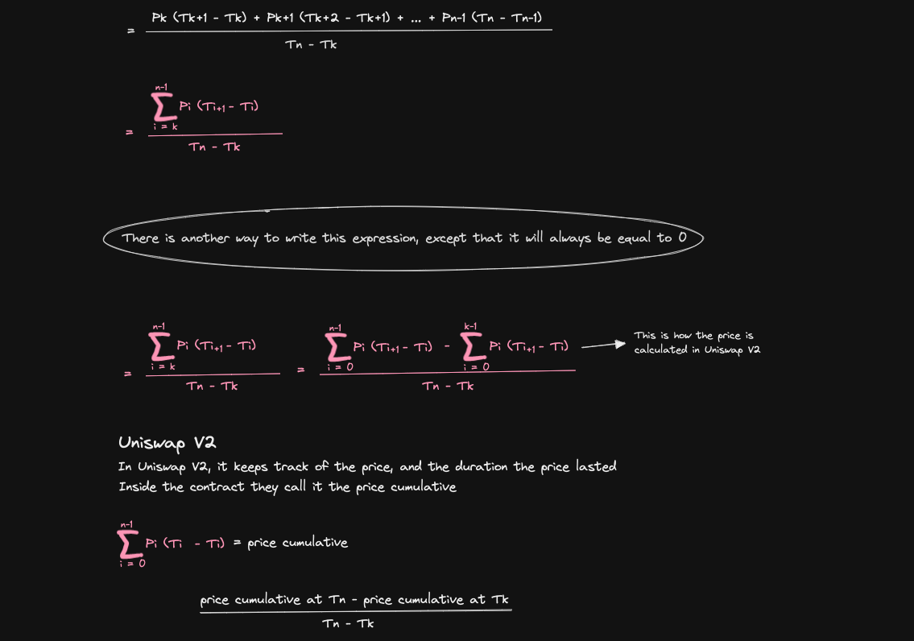
</div>

<p align="right">(<a href="#readme-top">back to top</a>)</p>

## Uniswap V2 Price Oracle

We saw the math to calculate TWAP, you can also calculate it in Uniswap V2 using Solidity.

This is the purpose of `UniswapV2Twap` contract

In Uniswap V2, the numbers are represented in decimals, but Solidity does not have any decimal datatypes, so we'ell be using `FixedPoint.sol` library

The datatype `FixedPoint.uq112x112` represents a decimal number as follows:

range: [0, 2e112 - 1]
resolution: 1 / 2e112

The `IUniswapV2Pair` contract is the pair contract that holds the two tokens and does the swaps

### Constructor

Since we're using Solidity 0.6, constructor must be declared as `public`

1. We set the pair first
2. We set `token0` and `token1` from `pair`
3. We record `price0CumulativeLast` and `price1CumulativeLast` and the last time that these variables were updated: `blockTimestampLast` using `getReserves()`, it returns 3 outputs but we only need the third

### Function update

1. To get the current `price0Cumulative`, current `price1Cumulative` and `blockTimestamp`, we call `currentCumulativePrices()` on `UniswapV2OracleLibrary` by passing in the address of the pair
2. Calculate how much time has elapsed since the last time we called `update()`. This time elapsed must be greather than the `period` defined as state variable
3. Calculate the price averages (`price0Average` and `price1Average`) by taking the current price cumulative, substracting it from the last price cumulative, and dividing it over the time elapsed. Cast it into a `FixedPoint`
   => Note that `up112x112` is a struct and the input for this struct must be a `uint224` => cast the calcul expression

   The expression below, used to calculate the price averages, is the exact same equation that we derived from `How do we compute the Time Weighted Average Price from Tk to Tn?`

   ```js
   price0Average = FixedPoint.uq112x112(
     uint224((price0Cumulative - price0CumulativeLast) / timeElapsed)
   );
   price1Average = FixedPoint.uq112x112(
     uint224((price1Cumulative - price1CumulativeLast) / timeElapsed)
   );
   ```

   **Keep in mind that we don't care if the numbers overflows** This is why we are not using `SafeMath`

4. Finally, update the state variables: `price0CumulativeLast`, `price1CumulativeLast` and `blockTimestampLast`

### Function consult

Giving the token and the amount of token put in, this function will calculate the amount out using the `price0Average` and `price1Average`

1. The token must be token0 or token1
2. Compute `amountOut`using `price0Average` and `amountIn` argument (.mul). We have to put it back to uint using a function called `decode144()`

### Goerli

- Twap: 0x321C105b714847Bd40513c91d89028FaF7F38692
- pair: 0x28cee28a7C4b4022AC92685C07d2f33Ab1A0e122

<p align="right">(<a href="#readme-top">back to top</a>)</p>

## Constant Product AMM Spot Price

<div>
 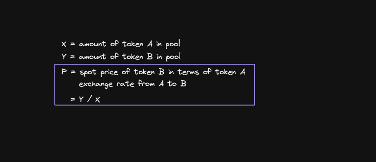
</div>

### P = Y / X from geometry

<div>
 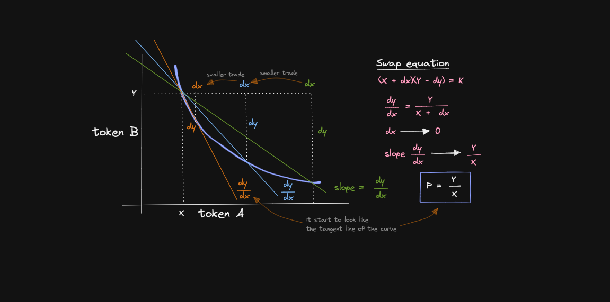
</div>

### P = Y / X from calculus

<div>
 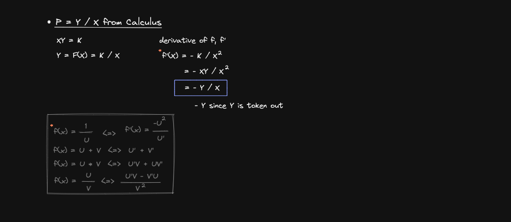
</div>

## Constant Product AMM Spot Price Examples

### Uniswap V2

<div>
 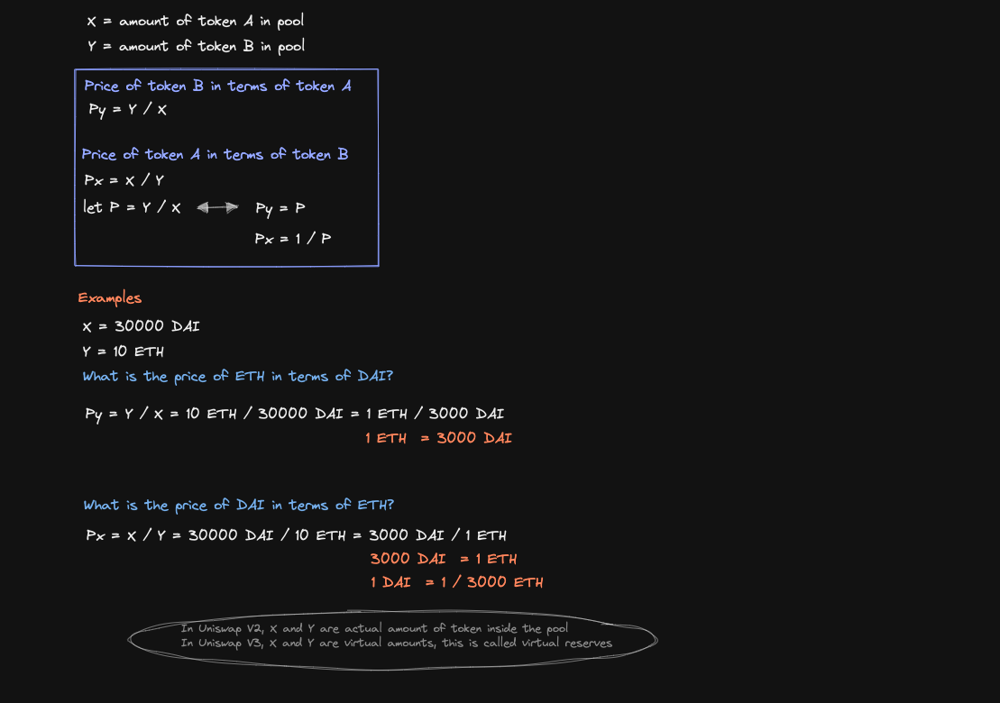
</div>

### Uniswap V3

<div>
 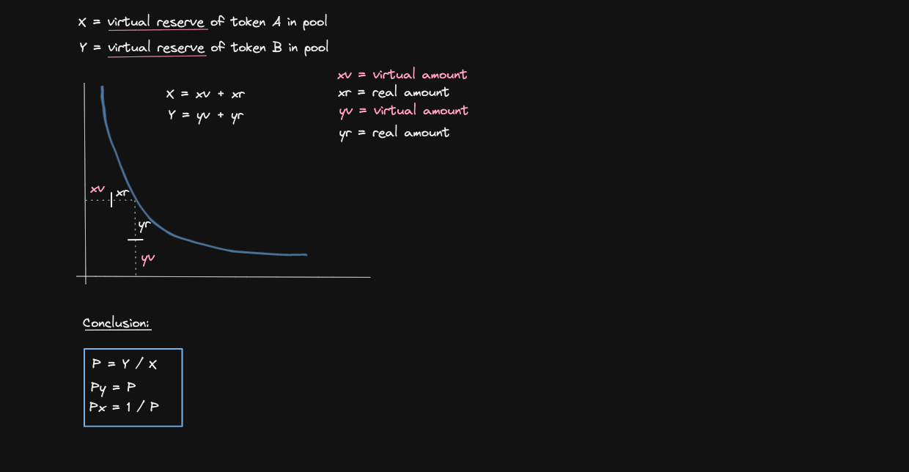
</div>

## Uniswap V3 Twap

<div>
 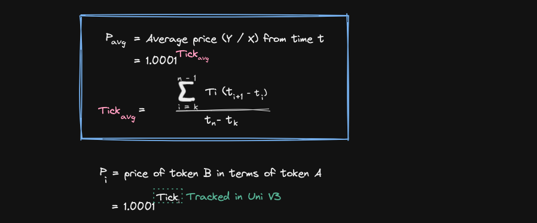
</div>

However, virtual reserves are not tracked in Uni V3

The `Tick` that is used to compute the current price is tracked in Uni V3

<div>
 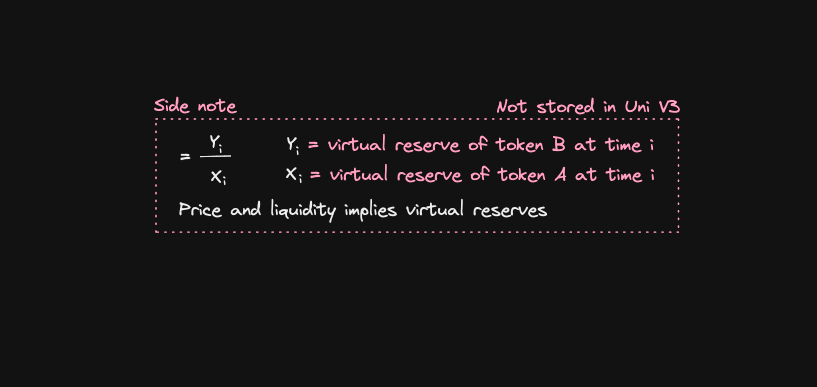
</div>

### Example

<div>
 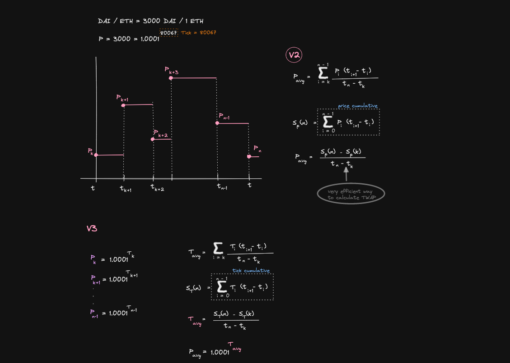
</div>

### Pricing difference between Uni V2 and Uni V3

<div>
 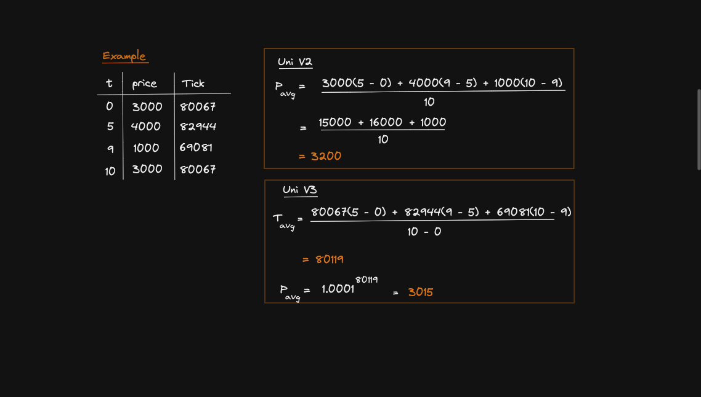
</div>

<p align="right">(<a href="#readme-top">back to top</a>)</p>

## Uniswap V3 Price Oracle

### Constructor

1. Set `token0` and `token1`
2. get the pool by calling `getPool()` on, `IUniswapV3Factory` and set the state variable
3. To call `getPool()` we need to pass in 3 parameters: address of the tokens, and the fee => set factory address and fee (uint24)
4. Check that the pool is a valid pool (not address(0)) and finally set it (state variable)

### Function estimateAmountOut

1. Define `tokenIn` and `tokenOut`
2. Get the average tick: Call `consult()` on `OracleLibrary` like so:

```js
    (int24 tick, ) = OracleLibrary.consult(pool, secondsAgo);
```

We'll copy paste the code to compute `tick` directly from the library to **_save some gas_**

3. Call `GetQuoteAtTick()` on `OracleLibrary` to set the `amountOut`

### Forking mainnet

`hardhat.config.js`

```sh
  networks: {
        hardhat: {
          forking: {
            url: `https://eth-mainnet.alchemyapi.io/v2/${process.env.ALCHEMY_API_KEY}`,
       },
     },
  }
```

`.env`

```sh
ALCHEMY_API_KEY=...
```

`terminal1`

```sh
ALCHEMY_API_KEY=...
npx hardhat node --fork https://eth-mainnet.g.alchemy.com/v2/$ALCHEMY_API_KEY
```

`terminal2`

```sh
npx hardhat test --network localhost
```

<p align="right">(<a href="#readme-top">back to top</a>)</p>

## Geometric Mean

<div>
 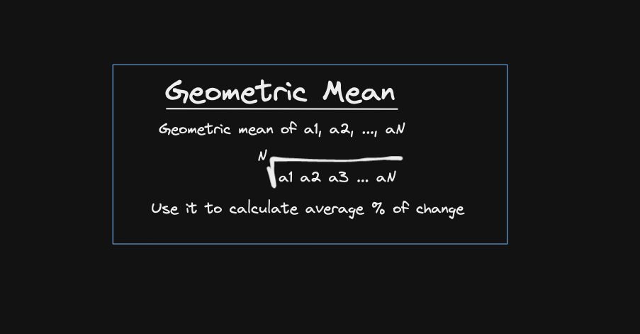
</div>

### Example

<div>
 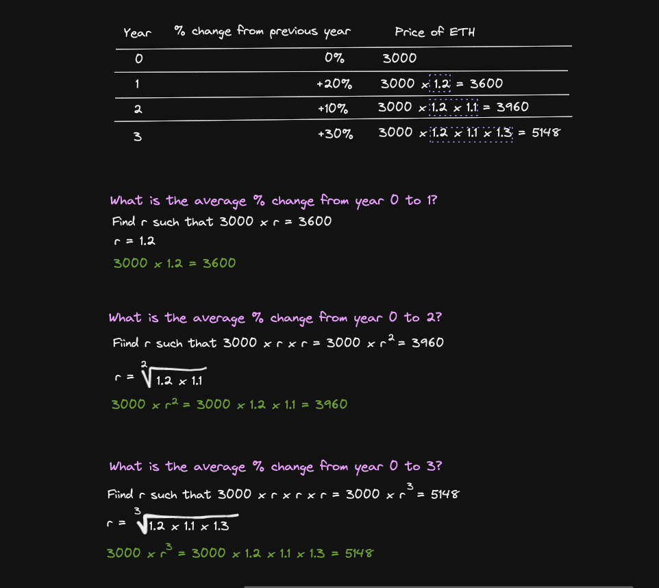
</div>

### Comapraison With Arithmetic Mean

<div>
 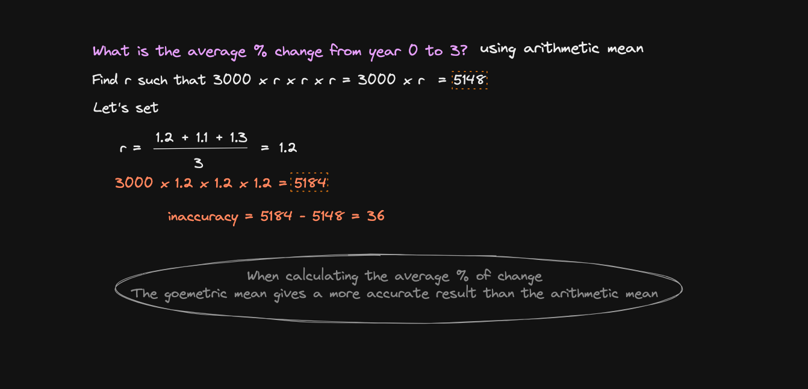
</div>

<p align="right">(<a href="#readme-top">back to top</a>)</p>

## Uniswap V3 TWAP and Geometric Mean

<div>
 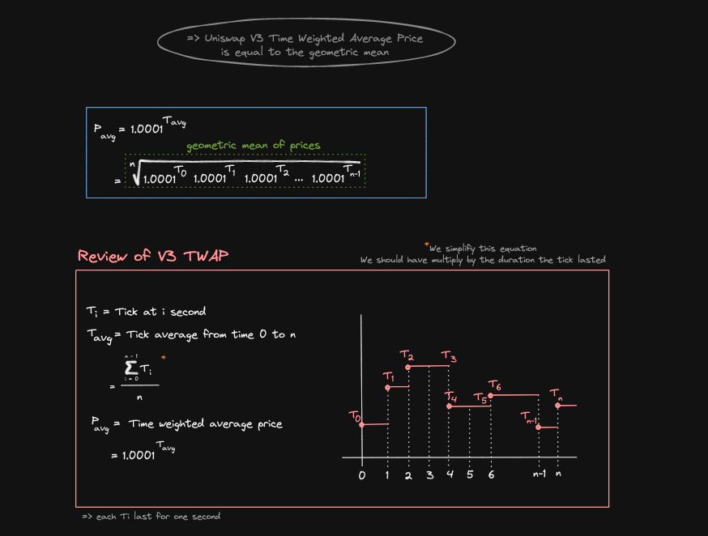
</div>

<div>
 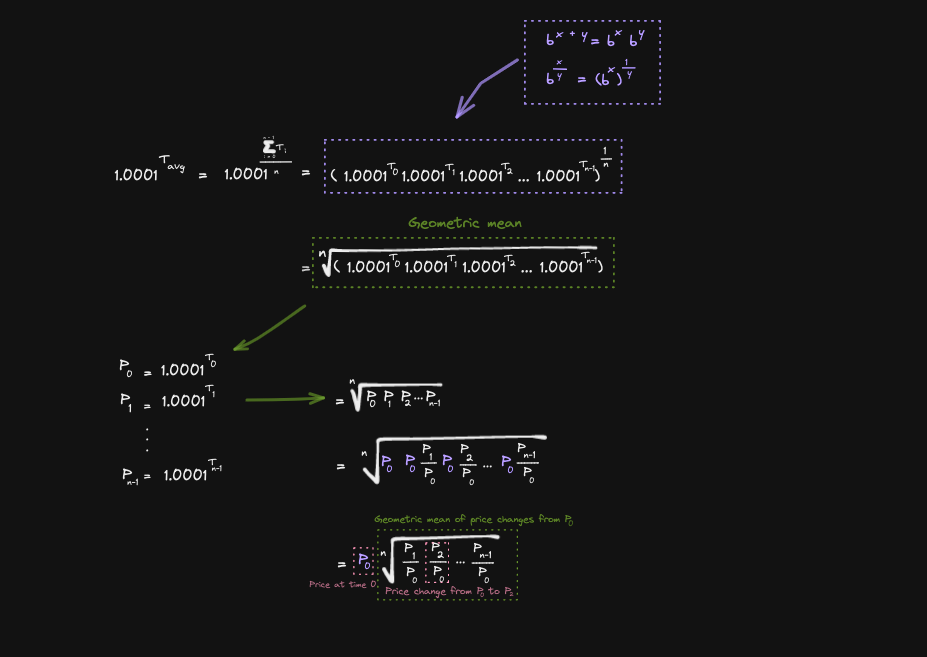
</div>

<div>
 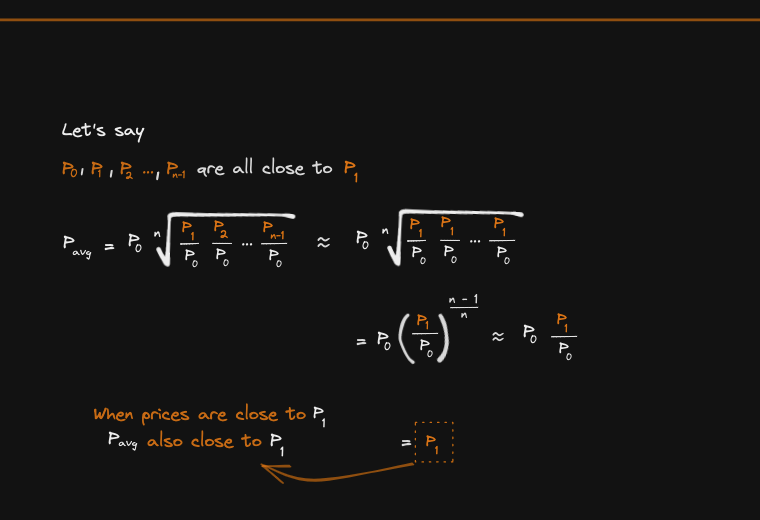
</div>

<p align="right">(<a href="#readme-top">back to top</a>)</p>

## Uniswap V3 TWAP Inverse Price

<div>
 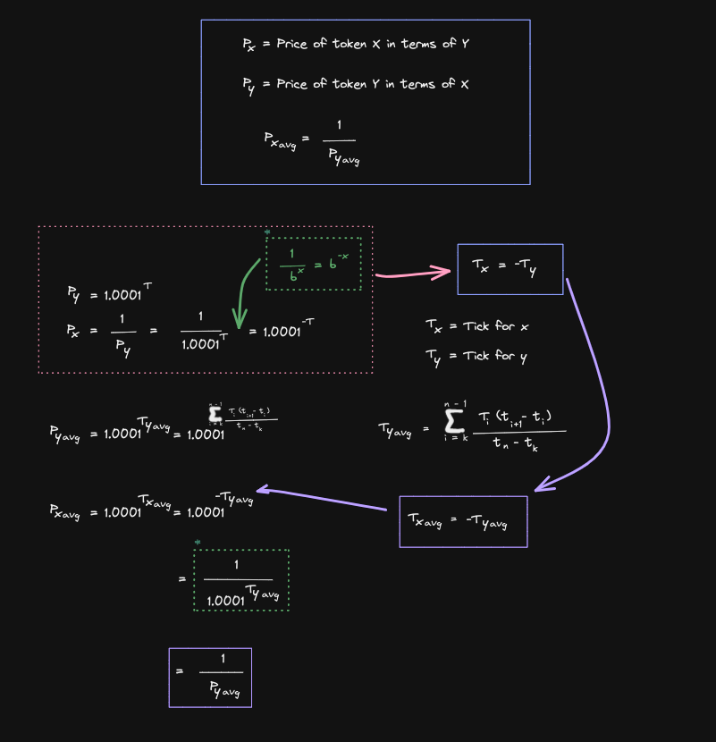
</div>

### Not in Uniswap V2

<div>
 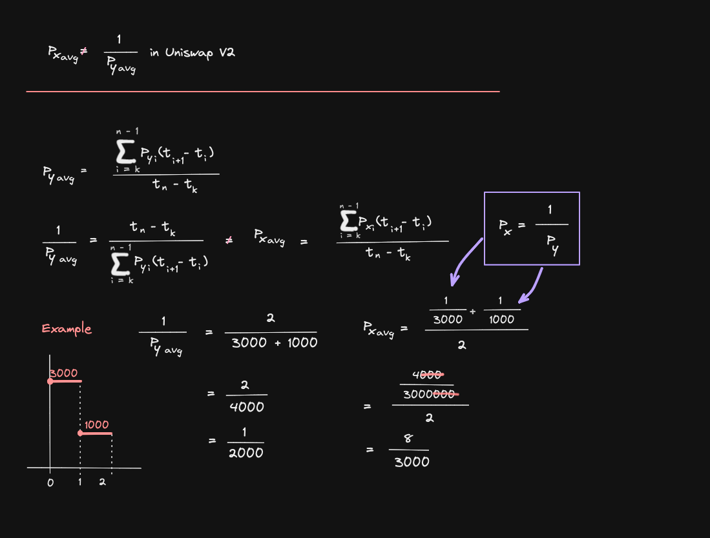
</div>

<p align="right">(<a href="#readme-top">back to top</a>)</p>

## Note

This contract assumes that token0 and token1 both have same decimals

Consider fees = 0.3%

### Further reading

(...soon)

### Sources

<p align="right">(<a href="#readme-top">back to top</a>)</p>

<!-- ROADMAP -->

## Roadmap

- [ ] Uniswap V3 TWAP
- [ ] Further reading
- [ ] Deploy script
- [ ] Unit test

See the [open issues](https://github.com/Aboudoc/Constant-Product-AMM.git/issues) for a full list of proposed features (and known issues).

<p align="right">(<a href="#readme-top">back to top</a>)</p>

<!-- CONTRIBUTING -->

## Contributing

Contributions are what make the open source community such an amazing place to learn, inspire, and create. Any contributions you make are **greatly appreciated**.

If you have a suggestion that would make this better, please fork the repo and create a pull request. You can also simply open an issue with the tag "enhancement".
Don't forget to give the project a star! Thanks again!

1. Fork the Project
2. Create your Feature Branch (`git checkout -b feature/AmazingFeature`)
3. Commit your Changes (`git commit -m 'Add some AmazingFeature'`)
4. Push to the Branch (`git push origin feature/AmazingFeature`)
5. Open a Pull Request

<p align="right">(<a href="#readme-top">back to top</a>)</p>

<!-- LICENSE -->

## License

Distributed under the MIT License. See `LICENSE.txt` for more information.

<p align="right">(<a href="#readme-top">back to top</a>)</p>

<!-- CONTACT -->

## Contact

Reda Aboutika - [@twitter](https://twitter.com/AboutikaR) - reda.aboutika@gmail.com

Project Link: [https://github.com/Aboudoc/Constant-Product-AMM.git](https://github.com/Aboudoc/Constant-Product-AMM.git)

<p align="right">(<a href="#readme-top">back to top</a>)</p>

<!-- ACKNOWLEDGMENTS -->

## Acknowledgments

- [Smart Contract Engineer](https://www.smartcontract.engineer/)

<p align="right">(<a href="#readme-top">back to top</a>)</p>

<!-- MARKDOWN LINKS & IMAGES -->
<!-- https://www.markdownguide.org/basic-syntax/#reference-style-links -->

[contributors-shield]: https://img.shields.io/github/contributors/Aboudoc/Constant-Product-AMM.svg?style=for-the-badge
[contributors-url]: https://github.com/Aboudoc/Constant-Product-AMM/graphs/contributors
[forks-shield]: https://img.shields.io/github/forks/Aboudoc/Constant-Product-AMM.svg?style=for-the-badge
[forks-url]: https://github.com/Aboudoc/Constant-Product-AMM/network/members
[stars-shield]: https://img.shields.io/github/stars/Aboudoc/Constant-Product-AMM.svg?style=for-the-badge
[stars-url]: https://github.com/Aboudoc/Constant-Product-AMM/stargazers
[issues-shield]: https://img.shields.io/github/issues/Aboudoc/Constant-Product-AMM.svg?style=for-the-badge
[issues-url]: https://github.com/Aboudoc/Constant-Product-AMM/issues
[license-shield]: https://img.shields.io/github/license/Aboudoc/Constant-Product-AMM.svg?style=for-the-badge
[license-url]: https://github.com/Aboudoc/Constant-Product-AMM/blob/master/LICENSE.txt
[linkedin-shield]: https://img.shields.io/badge/-LinkedIn-black.svg?style=for-the-badge&logo=linkedin&colorB=555
[linkedin-url]: https://www.linkedin.com/in/r%C3%A9da-aboutika-34305453/?originalSubdomain=fr
[product-screenshot]: https://ethereum.org/static/28214bb68eb5445dcb063a72535bc90c/9019e/hero.webp
[Hardhat]: https://img.shields.io/badge/Hardhat-20232A?style=for-the-badge&logo=hardhat&logoColor=61DAFB
[Hardhat-url]: https://hardhat.org/
[Ethers.js]: https://img.shields.io/badge/ethers.js-000000?style=for-the-badge&logo=ethersdotjs&logoColor=white
[Ethers-url]: https://docs.ethers.org/v5/
[Vue.js]: https://img.shields.io/badge/Vue.js-35495E?style=for-the-badge&logo=vuedotjs&logoColor=4FC08D
[Vue-url]: https://vuejs.org/
[Angular.io]: https://img.shields.io/badge/Angular-DD0031?style=for-the-badge&logo=angular&logoColor=white
[Angular-url]: https://angular.io/
[Svelte.dev]: https://img.shields.io/badge/Svelte-4A4A55?style=for-the-badge&logo=svelte&logoColor=FF3E00
[Svelte-url]: https://svelte.dev/
[Laravel.com]: https://img.shields.io/badge/Laravel-FF2D20?style=for-the-badge&logo=laravel&logoColor=white
[Laravel-url]: https://laravel.com
[Bootstrap.com]: https://img.shields.io/badge/Bootstrap-563D7C?style=for-the-badge&logo=bootstrap&logoColor=white
[Bootstrap-url]: https://getbootstrap.com
[JQuery.com]: https://img.shields.io/badge/jQuery-0769AD?style=for-the-badge&logo=jquery&logoColor=white
[JQuery-url]: https://jquery.com

```

```
